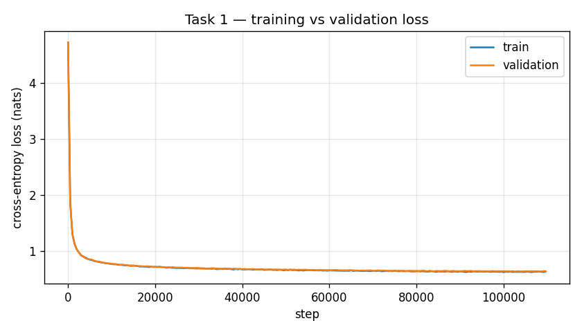

# Task 1 — GPT From Scratch — Sivasurya Chandran

Every number on this page comes from `checkpoints/metrics_train.json`, `checkpoints/generation_metrics.json` and `checkpoints/manifest.json`.

- **Hardware:** NVIDIA Tesla T4 on Google Colab (Linux x86_64, 2 vCPUs), Python 3.13, PyTorch 2.11.0+cu128, fp16 mixed precision.
- **Checkpoints:** `checkpoints/gpt_final.pt` (the one the metrics are computed on) and `checkpoints/gpt_best.pt` (lowest validation loss).
- **Raw log:** `logs/train_raw.log`, with a byte-identical copy at `reproducibility/raw_logs/sivasurya_chandran/task1_llm/train_raw.log`.
- **Notebook:** `src/task1_gpt.ipynb`, executed on the T4. Its metrics cell ran before I corrected the gradient-norm statistics (explained below), so it still shows `Infinity` for those values.

## What I built

**Data.** I sampled 110K stories from the TinyStories train split with seed 1337, used 100K for training and 10K for validation, and joined each set with newlines. That gives 89.8M training characters and 9.0M validation characters.

**Tokeniser.** It works at the character level. I wrote my own `char_to_idx` / `idx_to_char` maps from the sampled text, which gave a vocabulary of 109 characters. Most of it is letters, digits and punctuation, but a few odd characters such as ` à ⠜ € ™` also show up. They are encoding errors that are already in TinyStories. I left them in because they are rare and I didn't want to alter the raw data.

**Sequences.** Inputs and targets are shifted by one: `x = ids[s:s+128]`, `y = ids[s+1:s+129]`. I used non-overlapping windows, so one epoch is one pass over all of them, which is 10,964 steps at batch size 64.

**Model** (`src/model.py`). I wrote it from scratch and did not use `nn.MultiheadAttention`, `nn.Transformer*` or `scaled_dot_product_attention`. It has:
- learned token and position embeddings, both 256-d;
- six pre-LayerNorm Transformer blocks. Each block has:
  - 8-head causal self-attention, with a lower-triangular mask so position *t* only sees positions up to *t*;
  - a GELU feed-forward layer at 4× width;
  - residual connections and dropout 0.1;
- a final LayerNorm and a linear head over the 109 characters.

In total that is 4,827,648 parameters.

**Training:**
- loss: cross-entropy;
- optimiser: AdamW with betas 0.9 and 0.95, and weight decay 0.01 on the weight matrices only;
- learning rate: 500 warm-up steps up to 3e-4, then cosine decay down to 10% of the peak;
- gradient clipping at 1.0;
- 10 epochs (109,640 steps) with fp16 autocast and a GradScaler.

**Generation.** I used five prompts. Each one got one greedy continuation and three sampled at temperature 0.8, with 300 new characters each.

## Design choices

**Character level.** The assignment asks for it. A side effect is that the vocabulary is tiny (109), so nearly all of the parameters end up in the Transformer blocks instead of the embedding table.

**Size: 6 layers, 256-d, 8 heads, about 4.8M parameters.** I sized this to fit the data and about two hours on a T4. Ten epochs over ~90M characters is roughly 900M training tokens. The gap between train and validation loss at the end was only 0.008 nats, so the model isn't overfitting. If anything it's on the small side, and a bigger model would be the obvious next experiment.

**Context of 128 characters.** That's about two or three TinyStories sentences, and it keeps the quadratic attention cost down. It is also the model's biggest weakness, as the failure analysis shows: once a character's name falls out of the window, the model loses track of it.

**Pre-LayerNorm.** It is more stable than post-LN when training from scratch without much learning-rate tuning. I didn't see any loss spikes or NaNs.

**Warm-up then cosine decay.** Adam's second-moment estimates are poor for the first few hundred steps, and the warm-up keeps the early updates small while they settle. The cosine decay lets the loss keep creeping down late in training: the validation loss at the last check of each epoch went from 0.656 in epoch 6 to 0.637 in epoch 10.

### How this differs from my teammate's model

Rajesh Paruchuri built his Task 1 model independently. The main differences:

| | Mine | Rajesh's |
|---|---|---|
| Width / heads / context | 256 / 8 / 128 characters | 192 / 6 / 192 characters |
| Parameters | 4.83M, separate LM head | 2.72M, LM head tied to the embedding |
| Optimiser | lr 3e-4, weight decay 0.01 | lr 1e-3, weight decay 0.1 |
| Data split | random sample of 110K stories, newline-joined | story-disjoint split with an explicit `<|eos|>` token |
| Hardware | Colab T4 with fp16 | Apple M4 (MPS), fp32 |

My validation cross-entropy is lower (0.639 vs his 0.711). Part of that is model size. His split is also stricter, because none of his validation stories appear in training, so the two numbers aren't directly comparable.

## Metrics

| Metric | Value |
|---|---|
| Training cross-entropy (nats/char) | 0.6303 |
| Validation cross-entropy (nats/char) | 0.6385 |
| Perplexity (val) | 1.8937 |
| Bits-per-character (val) | 0.9212 |
| Generalization gap (val − train) | 0.0082 |
| Top-1 next-char accuracy (val) | 0.7955 |
| Distinct-1 / 2 / 3 | 0.2525 / 0.6764 / 0.8860 |
| Repeated 4-gram rate (sampled / greedy) | 0.0063 / 0.2671 |
| Grad norm mean / p95 / max | 0.343 / 0.489 / 7.770 |
| NaN steps / loss spikes | 0 / 0 |
| fp16 overflow steps skipped by GradScaler | 41 |
| Parameter count | 4,827,648 |
| Training tokens/sec | 133,346 |
| Generation tokens/sec | 217.2 |
| Peak memory (MB) | 944.0 |
| Total training time (s) | 6,735.6 (about 112 min) |

How each metric is computed:
- **Cross-entropy:** the average over 200 random batches of 64 × 128 characters.
- **Perplexity:** e^CE.
- **Bits per character:** CE / ln 2.
- **Top-1 accuracy:** how often the most likely character is the right next one.
- **Distinct-n:** unique word n-grams divided by total word n-grams, pooled over the 15 sampled texts.
- **Repeated 4-gram rate:** the share of word 4-grams in a sample that already appeared earlier in the same sample.

**Gradient norms.** With fp16, the GradScaler sometimes overflows on a step. The gradient norm for that step is then infinite and the optimizer skips the step, which is normal AMP behaviour. It happened on 41 of 109,640 steps (0.04%). The statistics above are over the finite norms only. I recomputed them from the full per-step list saved in `checkpoints/train_state.pt` with `tools/fix_grad_norm_stats.py`. The original values are still in `metrics_train.json`, under the `*_incl_overflow` keys.

## Loss curves

Both curves drop sharply in the first ~2K steps, while the model works through the warm-up and learns basic character statistics. After that they fall slowly and stay almost on top of each other for all ten epochs.

Validation loss at the last evaluation in each epoch (50 batches each, so it is slightly noisier than the final 200-batch number in the table above):

| Epoch | 1 | 2 | 3 | 4 | 5 | 6 | 7 | 8 | 9 | 10 |
|---|---|---|---|---|---|---|---|---|---|---|
| Val CE | 0.772 | 0.714 | 0.686 | 0.674 | 0.669 | 0.656 | 0.647 | 0.638 | 0.640 | 0.637 |

The last three epochs are almost flat, so the model is close to converged at this size.

## Training stability and run history

- There were no NaN losses and no loss spikes. I counted a spike as a batch loss above 1.5× its running average.
- Gradient norms stayed small after the first few hundred steps (p95 of 0.49).
- **Resume after epoch 5.** The Colab session dropped after epoch 5 because my laptop went to sleep. I resumed from `checkpoints/train_state.pt`, which stores the model, optimizer, loss-scaler and RNG state after every epoch, so the learning-rate schedule and data order picked up where they stopped. The raw log keeps every start and resume, unedited.
- **The first resume attempts crashed.** The saved RNG state was being loaded onto the GPU. I fixed that in `src/train.py`, and the run that worked retrained epoch 6 from the beginning.

## Generated samples

All samples are in `outputs/samples.txt`. A greedy example:

> Once upon a time, there was a little girl named Lily. She loved to play outside in the sunshine. One day, she went to the park with her mommy and daddy. They saw a big slide and wanted to go down it.

## Failure analysis

[`failure_analysis.md`](failure_analysis.md) covers three failure cases:
- a repetition loop;
- losing track of characters;
- broken grammar with events that don't make sense.
