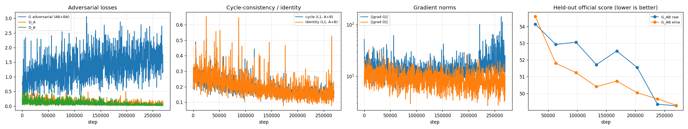

# Task 3 — CycleGAN Style Transfer (photo ↔ Monet) — Sivasurya Chandran

The numbers on this page come from these files:
- `checkpoints/metrics_train.json` and `checkpoints/metrics_eval.json`;
- `submission.csv` and `submission_details.json`;
- `checkpoints/variants_summary.json`;
- the raw logs in `logs/`.

**Hardware:** NVIDIA GeForce RTX 4090 (24 GB), AMD CPU with 32 threads, Windows 11, Python 3.9.13, PyTorch 2.6.0+cu124, bf16 mixed precision.

**Checkpoints:** `checkpoints/{G_AB,G_BA,D_A,D_B}.pt`. In the code, A = photo and B = Monet, so `G_AB` is photo → Monet.

**Raw log:** `logs/train_raw.log`, with a byte-identical copy at `reproducibility/raw_logs/sivasurya_chandran/task3_gan/train_raw.log`.

**Notebooks:**
- `src/task3_cyclegan.ipynb`: training, evaluation and submission, executed with outputs.
- `src/Part3_Evaluation_Script_run.ipynb`: the instructor's evaluation notebook run on my outputs.

## What I built

**Data.** The competition provides 300 Monet paintings and 7,038 photos, all 256×256. I split them like this:
- 1,000 random photos (seed 1337) are held out for checkpoint selection and evaluation, and the other 6,038 are used for training;
- all 300 paintings are used for training.

The two domains are unpaired: every step draws a random photo and an unrelated random painting. Training images are resized to 286×286, randomly cropped back to 256×256, and randomly flipped.

**Model** (`src/models.py`):
- **Generators.** Two ResNet generators with 64 base filters and 9 residual blocks, InstanceNorm and reflection padding, 11,378,179 parameters each. One change from the original CycleGAN: the decoder upsamples with nearest-neighbour resize followed by a convolution, instead of a transposed convolution. My first run (v1) used transposed convolutions and had visible checkerboard patterns, which this change removed.
- **Discriminators.** Two 70×70 PatchGAN discriminators with 64 base filters, 2,764,737 parameters each.

The total is 28,285,832 parameters.

**Losses:**
- LSGAN adversarial loss for both directions;
- cycle-consistency L1, weighted 10;
- identity L1, weighted 2.5.

Each discriminator also sees fakes from a 50-image history buffer.

**Small-data tricks:**
- **DiffAugment.** Random translation is applied to every image the discriminator sees, real or fake. With only 300 paintings, a discriminator without augmentation memorises them quickly.
- **EMA.** Exponential moving averages (decay 0.999) of both generators are kept alongside the trained weights.

**Training** (`src/train.py`, `src/run_final.py`, `config.yaml`, variant `V2_CONTINUE`):
- **Starting point.** I warm-started from my earlier v2 model, which had trained for 50K steps on a Colab T4.
- **Steps.** I then trained for 270 epochs of 1,000 steps each (270,000 steps) with batch size 1.
- **Optimiser.** Adam, lr 2e-4, betas 0.5 / 0.999.
- **Schedule.** Constant learning rate for the first 108 epochs (40%), then linear decay to zero.
- **Run length.** The run sized its own schedule: after the first epoch it measured its speed and fitted the run into a 12.7-hour budget.

**Checkpoint selection.** At nine points during training, the run translated two separate sets of 300 held-out photos and the 300 paintings, then scored them with the instructor's FID/MiFID formula in both directions. At each check it tried four combinations: raw or EMA weights for each of the two generators. The best combination came from the last check, epoch 269, with the raw weights for both generators.

## Design choices

**Why continue from v2 instead of starting fresh.** In all my earlier runs, FID mostly improved while the learning rate was decaying. v2 had trained on a short schedule, so a long run with a slow decay was the cheapest way to get more out of the same architecture. Starting from v2 also meant the 4090's time went into refining a model that already worked, rather than re-learning the basics.

**Why translation-only DiffAugment.** In v2, colour augmentation came at the same time as blob artifacts in the middle of training. v3 used translation only and looked cleaner, so I kept that.

**Why select on both directions.** The instructor's score averages photo→Monet and Monet→photo. My earlier runs only checked photo→Monet, and the Monet→photo direction had quietly got worse from v1 to v2. Scoring both directions at every check fixed that.

**Why keep both raw and EMA weights.** EMA weights won at the first seven checks, beating the raw pair by up to 1.8 points of the selection score. Near the end, though, the learning rate was almost zero, the raw weights had settled, and the averaged copy lagged behind them (49.267 raw vs 49.296 EMA at epoch 269). Scoring both meant I didn't have to guess which would win.

### How this differs from my teammate's model

Rajesh Paruchuri trained his own CycleGAN:

| | Mine | Rajesh's |
|---|---|---|
| Generator | ResNet, 64 filters, 9 blocks, 11.4M params each | ResNet, 48 filters, 6 blocks, 4.4M params each |
| Discriminator | PatchGAN with InstanceNorm | PatchGAN with spectral norm, no norm layers |
| DiffAugment | translation | colour, translation, cutout |
| Identity weight | 2.5 | 5 |
| Training | 50K (v2) + 270K steps, full 256×256 crops, RTX 4090 | 24K steps on 128×128 crops, Apple M4 |
| Submission FID / MiFID (instructor's script) | **101.909 / 0.4082** | 149.484 / 0.4135 |

Both of us found that Monet → photo is the harder direction.

## Results

### Submission (instructor's evaluation script)

`src/Part3_Evaluation_Script_run.ipynb` is the instructor's `Part3_Evaluation_Script.ipynb`. I changed only the folder paths and ran it on `outputs/`:
- `outputs/pred_A2B`: all 300 Monet paintings translated to photos by `G_BA`;
- `outputs/pred_B2A`: all 7,038 photos translated to Monet by `G_AB`.

The script uses the first 300 images of each folder, sorted by file name.

| Direction | FID | MiFID |
|---|---|---|
| Photo → Monet (`pred_B2A` vs real Monet) | 96.956 | 0.4024 |
| Monet → photo (`pred_A2B` vs real photos) | 106.862 | 0.4139 |
| **Submission (mean of both)** | **101.909** | **0.4082** |

`submission.csv` = `1, 101.90883359049133, 0.40815766155719757`. The leaderboard shows −(FID + MiFID)/2, so this entry would score **−51.1585**.

**Kaggle.** The team is `PairProgramming_Team_06`. I uploaded this `submission.csv` on 2026-10-04 (a copy is in `kaggle_submissions/final_submission.csv`), and its public score is **−51.1585**. The team's public rank is **11**.

### Evaluation in both directions (`checkpoints/metrics_eval.json`)

`src/evaluate.py` computes these on held-out data:
- **photo → Monet:** 1,000 held-out photos, compared with the 300 real paintings;
- **Monet → photo:** the 300 paintings, compared with the 1,000 held-out real photos.

| Metric | Photo → Monet | Monet → photo |
|---|---|---|
| FID | 82.997 | 89.684 |
| KID (mean ± std) | 0.0126 ± 0.0008 | 0.0257 ± 0.0009 |
| Precision / recall | 0.576 / 0.630 | 0.697 / 0.428 |
| Density / coverage | 0.556 / 0.933 | 0.585 / 0.364 |
| Cycle-reconstruction L1 | 0.1053 | 0.0841 |
| LPIPS, input vs translation | 0.4204 | 0.4019 |
| LPIPS, input vs reconstruction | 0.3470 | 0.4437 |
| Content cosine similarity, input vs translation | 0.7316 | 0.7708 |
| Identity L1 | 0.1003 | 0.0797 |

**Why these FIDs differ from the submission.** They are lower than the submission FIDs because they compare more images: 1,000 photos instead of 300. FID is biased upward at small sample sizes, so these two tables can't be compared with each other directly.

**What the two directions show:**
- **Photo → Monet.** High coverage (0.93) but lower precision (0.58): the translations spread across the whole range of Monet's work, but not every single image is convincing.
- **Monet → photo.** The reverse: the outputs look photographic (precision 0.70) but only cover a narrow slice of real photos (coverage 0.36).

**Cycle consistency.** It works as intended. Translating there and back returns an image within about 0.08–0.11 mean absolute pixel difference of the original (on a 0–1 scale). You can see this in the bottom row of `checkpoints/eval_*_input_fake_rec.png`. Each grid shows the input on the top row, the translation in the middle, and the reconstruction at the bottom.

### Training behaviour and stability



| Quantity | Value |
|---|---|
| Final G adversarial / D_A / D_B loss | 1.584 / 0.063 / 0.035 |
| Final cycle / identity loss (unweighted L1, both directions) | 0.159 / 0.149 |
| Generator gradient norm, mean / p95 / max | 15.3 / 27.8 / 520.6 |
| Discriminator gradient norm, mean / p95 / max | 9.3 / 16.1 / 69.9 |
| NaN or infinite steps | 0 of 270,000 |
| bf16 overflow steps skipped | 0 |
| Parameters (G_AB + G_BA + D_A + D_B) | 28,285,832 |
| Training time | 24,770 s (6.9 h) |
| Training speed | 10.9 steps/s (one photo and one painting per step) |
| Peak GPU memory | 19,863 MB |

**Training was stable.** There were no NaNs and no skipped overflow steps. Gradients weren't clipped, so the occasional large generator gradient (max 520) is visible in the log. None of those spikes caused a loss blow-up.

**How the losses moved:**
- **Cycle and identity losses** fell steadily, from about 0.25 to about 0.15.
- **The discriminator losses** stayed low (0.03–0.10) throughout.
- **The generator's adversarial loss** drifted up from about 1.0 to about 1.5 in the second half. That is the usual sign of the discriminators getting stronger as the learning rate decays, and the selection score kept improving over the same period.

The selection score (lower is better, held-out photos) improved at every check except one (epoch 167):

| Epoch | 0 | 27 | 62 | 97 | 132 | 167 | 202 | 237 | 269 |
|---|---|---|---|---|---|---|---|---|---|
| Best selection score | 57.82 | 53.79 | 51.81 | 51.25 | 50.41 | 50.74 | 50.04 | 49.36 | 49.27 |
| Best weights (G_AB, G_BA) | EMA, raw | EMA, raw | EMA, EMA | EMA, EMA | EMA, EMA | EMA, EMA | EMA, EMA | raw, raw | raw, raw |

Most of the gain came in the last third of the run, while the learning rate was decaying, which matches what I saw in v2.

### Human audit

`src/human_audit.py prepare` chose 30 held-out photos with a fixed seed before anyone looked at the outputs, and saved each one as an anonymous photo | translation pair (`checkpoints/audit/images/`). Two raters scored every pair independently from 1 to 5. They used `checkpoints/audit/rate_audit.html` and their sheets are `ratings_rater1.csv` and `ratings_rater2.csv`. `src/human_audit.py score` wrote `checkpoints/audit/audit_results.json`.

| Criterion | Rater 1 | Rater 2 | Mean | Cohen's κ (quadratic) | Exact / within-1 agreement |
|---|---|---|---|---|---|
| Style (looks like a Monet) | 3.57 | 3.73 | 3.65 | 0.13 | 33% / 83% |
| Content (scene preserved) | 3.83 | 4.03 | 3.93 | 0.29 | 33% / 83% |
| Artifacts (5 = none) | 3.43 | 4.07 | 3.75 | 0.28 | 27% / 83% |
| **Overall** | | | **3.78** | **0.24** | 31% exact |

**What the raters thought.** Content is the best-rated criterion, which fits the strong cycle loss: the scene is almost always still there. Style is the lowest, which matches the FID picture: the outputs look painted, but not always like Monet.

**How well they agreed.** Agreement is only fair (quadratic κ 0.24). The raters gave the same score 31% of the time but were within one point 83% of the time. Rater 2 was more lenient, especially on artifacts (4.07 vs 3.43), so most disagreements are a shift in scale rather than opposite opinions. A short calibration round on a few shared examples before rating would probably raise κ.

## How the final design came about

Before the final run I trained three shorter versions of this model. Their configs, logs and samples are in the `history/` folders (see `HISTORY.md`), and each one changed the design:
- The first version used transposed convolutions and had checkerboard artifacts, so I switched to resize-convolution.
- The second showed that FID improved almost only while the learning rate was decaying, which is why the final run uses a long schedule with a long decay.
- The third showed that the outputs needed more Monet-like texture, not better colour: matching the colour statistics exactly barely helped.

## How to reproduce

From `task3_gan/sivasurya_chandran/`, after getting the data with `python ../download_data.py` (or `--zip <dataset.zip>`):

```bash
python src/run_final.py --hours 13 --variants V2_CONTINUE   # trains, promotes, evaluates, translates and scores
python src/evaluate.py --config config.yaml                 # metrics_eval.json and outputs/pred_A2B
python src/translate.py --config config.yaml --input ../data/photo_jpg --output outputs/pred_B2A --flat
python evaluate_local.py --pred_dir outputs --out submission.csv   # the instructor's script as a script
```

`V2_CONTINUE` starts from v2's weights in `checkpoints/history/v2/`.

## Failure analysis

[`failure_analysis.md`](failure_analysis.md) covers:
- visual failure cases in both directions;
- the experiments that didn't work (UVCGAN-style generators and a PatchNCE continuation);
- a Windows encoding bug that briefly stopped the post-processing.
